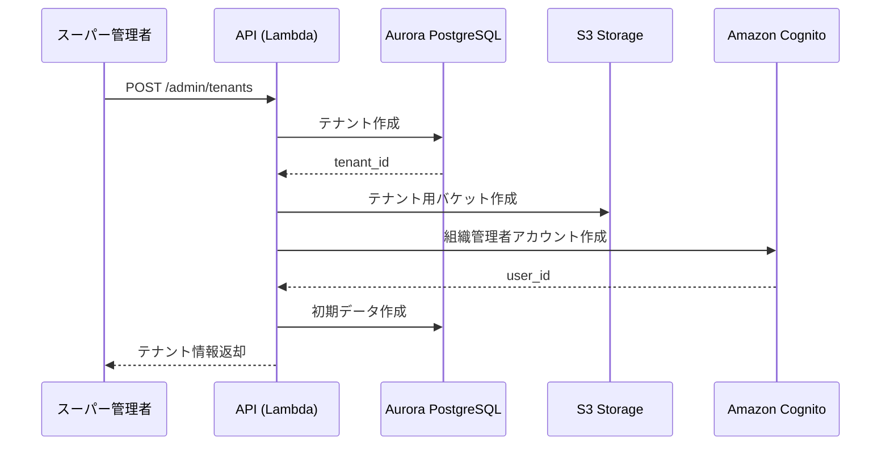

# マルチテナントアーキテクチャ

Prance Communication Platformのマルチテナント設計とロールベース権限管理

**バージョン:** 2.0
**最終更新:** 2026-03-05
**ステータス:** Phase 0 完了

---

## 目次

1. [マルチテナントアーキテクチャ概要](#1-マルチテナントアーキテクチャ概要)
2. [3階層ユーザーロール設計](#2-3階層ユーザーロール設計)
3. [データ分離戦略](#3-データ分離戦略)
4. [ロール権限マトリクス](#4-ロール権限マトリクス)
5. [プランと制限](#5-プランと制限)
6. [テナント管理フロー](#6-テナント管理フロー)
7. [セキュリティとコンプライアンス](#7-セキュリティとコンプライアンス)

---

## 1. マルチテナントアーキテクチャ概要

### 1.1 マルチテナントとは

Pranceプラットフォームは、**マルチテナント型SaaS**として設計されています。1つのプラットフォーム上で複数の組織（テナント）が独立して運用でき、それぞれのデータとリソースが完全に分離されます。

#### マルチテナントのメリット

| メリット | 説明 |
|---------|------|
| **コスト効率** | インフラを共有し、運用コストを削減 |
| **迅速なオンボーディング** | 新規組織が即座に利用開始可能 |
| **一元管理** | プラットフォーム全体を統一的に管理・更新 |
| **スケーラビリティ** | テナント数の増加に自動対応 |
| **セキュリティ** | Row Level Securityによる完全なデータ分離 |

### 1.2 アーキテクチャパターン

Pranceは**共有データベース + Row Level Security**パターンを採用しています。

```
┌──────────────────────────────────────────────────────────────┐
│                    プラットフォーム全体                       │
├──────────────────────────────────────────────────────────────┤
│                                                               │
│  ┌────────────┐  ┌────────────┐  ┌────────────┐            │
│  │ テナント A │  │ テナント B │  │ テナント C │            │
│  │ (採用企業) │  │ (教育機関) │  │ (研修企業) │            │
│  └──────┬─────┘  └──────┬─────┘  └──────┬─────┘            │
│         │                 │                 │                 │
│         └─────────────────┼─────────────────┘                 │
│                           │                                   │
│  ┌────────────────────────┴────────────────────────┐         │
│  │         共有インフラストラクチャ                 │         │
│  │  - Aurora PostgreSQL（RLS有効）                 │         │
│  │  - Lambda Functions                             │         │
│  │  - S3 Buckets（パス分離）                       │         │
│  │  - DynamoDB（tenant_id パーティションキー）     │         │
│  └─────────────────────────────────────────────────┘         │
└──────────────────────────────────────────────────────────────┘
```

### 1.3 データ分離レベル

| レイヤー | 分離方法 | 実装 |
|---------|---------|------|
| **データベース** | Row Level Security (RLS) | PostgreSQL RLS + Prisma Middleware |
| **ストレージ** | パスプレフィックス | S3: `tenants/{tenantId}/...` |
| **API** | テナントIDヘッダー | `X-Tenant-Id` 必須 |
| **認証** | Cognito カスタム属性 | `custom:tenantId` |
| **キャッシュ** | キープレフィックス | Redis: `tenant:{tenantId}:...` |

---

## 2. 3階層ユーザーロール設計

### 2.1 ロール階層図

```
┌──────────────────────────────────────────────────────────────┐
│                    スーパー管理者                             │
│                  (Super Administrator)                        │
│  - プラットフォーム全体の運営・管理                           │
│  - 全テナント・全ユーザーへのアクセス                         │
│  - グローバル設定（AIプロンプト、プロバイダ、プラン）         │
└────────────────────────┬─────────────────────────────────────┘
                         │
         ┌───────────────┴───────────────┐
         │                               │
┌────────┴───────────┐       ┌───────────┴────────────┐
│ クライアント管理者 │       │ クライアント管理者     │
│ (Client Admin)     │       │ (Client Admin)         │
│  テナント A        │       │  テナント B            │
│  - 自組織内の管理  │       │  - 自組織内の管理      │
│  - ユーザー管理    │       │  - ユーザー管理        │
│  - シナリオ管理    │       │  - シナリオ管理        │
└────────┬───────────┘       └───────────┬────────────┘
         │                               │
    ┌────┴────┐                     ┌────┴────┐
    │         │                     │         │
┌───┴───┐ ┌──┴────┐           ┌───┴───┐ ┌──┴────┐
│ User1 │ │ User2 │           │ User3 │ │ User4 │
│(一般) │ │(一般) │           │(一般) │ │(一般) │
└───────┘ └───────┘           └───────┘ └───────┘
```

### 2.2 ロール定義

#### 1. スーパー管理者（Super Administrator）

**役割:**
- プラットフォーム運営者（Pranceの社内管理者）
- 全テナントを横断した管理・監視
- システム全体の設定変更

**主な機能:**

```typescript
// スーパー管理者の権限範囲
const superAdminPermissions = {
  // テナント管理
  tenants: ['create', 'read', 'update', 'delete', 'suspend'],

  // プラン管理
  plans: ['create', 'read', 'update', 'delete'],

  // AI設定管理
  aiProviders: ['create', 'read', 'update', 'delete', 'switch'],
  aiPrompts: ['create', 'read', 'update', 'delete'],

  // グローバル設定
  globalSettings: ['read', 'update'],

  // 監視・分析
  analytics: ['readAll'],  // 全テナントのデータ

  // 課金管理
  billing: ['readAll', 'updateAll'],

  // ユーザー管理
  users: ['readAll', 'updateAll', 'deleteAll'],  // 全テナント
};
```

**UI画面:**

```
/admin/
├── dashboard/              # プラットフォーム全体ダッシュボード
├── tenants/                # テナント一覧・管理
│   ├── [id]/               # テナント詳細
│   └── create/             # 新規テナント作成
├── plans/                  # プラン管理
├── ai-prompts/             # AIプロンプト管理
├── ai-providers/           # AIプロバイダ管理
├── analytics/              # 全体分析
└── settings/               # グローバル設定
```

#### 2. クライアント管理者（Client Administrator）

**役割:**
- テナント（組織）の管理者
- 自組織内のユーザー・リソース管理
- シナリオ・アバター設定

**主な機能:**

```typescript
// クライアント管理者の権限範囲
const clientAdminPermissions = {
  // ユーザー管理（自組織内のみ）
  users: ['create', 'read', 'update', 'delete'],

  // シナリオ管理
  scenarios: ['create', 'read', 'update', 'delete'],

  // アバター管理
  avatars: ['create', 'read', 'update', 'delete'],

  // セッション管理
  sessions: ['readAll'],  // 自組織内の全セッション

  // レポート管理
  reports: ['readAll', 'export'],

  // ベンチマーク管理
  benchmarks: ['read', 'configure'],

  // API キー管理
  apiKeys: ['create', 'read', 'revoke'],

  // 組織設定
  organizationSettings: ['read', 'update'],

  // 課金情報
  billing: ['read'],  // 自組織のみ

  // 制限:
  // - 他テナントへのアクセス不可
  // - AIプロンプト・プロバイダ管理不可（閲覧のみ）
  // - プラン変更不可（閲覧のみ）
};
```

**UI画面:**

```
/client-admin/
├── dashboard/              # 組織ダッシュボード
├── users/                  # ユーザー管理
│   ├── list/               # ユーザー一覧
│   ├── [id]/               # ユーザー詳細
│   └── invite/             # ユーザー招待
├── scenarios/              # シナリオ管理
├── avatars/                # アバター管理
├── sessions/               # セッション一覧
├── reports/                # レポート一覧
├── benchmarks/             # ベンチマーク設定
├── api-keys/               # API キー管理
└── settings/               # 組織設定
```

#### 3. クライアントユーザー（Client User / 一般ユーザー）

**役割:**
- セッション実行者
- 自分のデータのみ閲覧・管理
- シナリオ作成（オプション）

**主な機能:**

```typescript
// クライアントユーザーの権限範囲
const clientUserPermissions = {
  // セッション実行
  sessions: ['create', 'read'],  // 自分のセッションのみ

  // レポート閲覧
  reports: ['read'],  // 自分のレポートのみ

  // ベンチマーク閲覧
  benchmarks: ['read'],  // 自分のベンチマークのみ

  // プロフィール管理
  profile: ['read', 'update'],

  // シナリオ作成（オプション）
  scenarios: ['create', 'read', 'update'],  // 自分のシナリオのみ

  // 制限:
  // - 他ユーザーのデータへのアクセス不可
  // - ユーザー管理不可
  // - 組織設定変更不可
  // - API キー管理不可
};
```

**UI画面:**

```
/dashboard/
├── home/                   # ホームダッシュボード
├── sessions/               # 自分のセッション一覧
│   ├── new/                # 新規セッション作成
│   └── [id]/               # セッション詳細・実行
├── reports/                # 自分のレポート一覧
├── benchmarks/             # 自分のベンチマーク
└── settings/               # プロフィール設定
```

### 2.3 ロール切り替え

一部のユーザーは複数のロールを持つことがあります（例: スーパー管理者がテスト用にクライアントユーザーとしてログイン）。

```typescript
// ロール切り替え実装
export function useRoleSwitcher() {
  const [currentRole, setCurrentRole] = useState<UserRole>('client_user');
  const { user } = useAuth();

  const availableRoles = user.roles; // ['super_admin', 'client_admin']

  const switchRole = (role: UserRole) => {
    if (!availableRoles.includes(role)) {
      throw new Error('Unauthorized role switch');
    }
    setCurrentRole(role);
    sessionStorage.setItem('active_role', role);
  };

  return { currentRole, availableRoles, switchRole };
}
```

---

## 3. データ分離戦略

### 3.1 Row Level Security (RLS)

PostgreSQLのRow Level Securityを使用し、SQLレベルでデータを分離します。

#### RLS有効化

```sql
-- organizations テーブル
ALTER TABLE organizations ENABLE ROW LEVEL SECURITY;

CREATE POLICY tenant_isolation ON organizations
  USING (id = current_setting('app.current_tenant_id')::uuid);

-- users テーブル
ALTER TABLE users ENABLE ROW LEVEL SECURITY;

CREATE POLICY tenant_isolation ON users
  USING (tenant_id = current_setting('app.current_tenant_id')::uuid);

-- sessions テーブル
ALTER TABLE sessions ENABLE ROW LEVEL SECURITY;

CREATE POLICY tenant_isolation ON sessions
  USING (
    EXISTS (
      SELECT 1 FROM users
      WHERE users.id = sessions.user_id
        AND users.tenant_id = current_setting('app.current_tenant_id')::uuid
    )
  );

-- スーパー管理者用ポリシー（RLSバイパス）
CREATE POLICY super_admin_access ON organizations
  TO super_admin
  USING (true);
```

#### Prisma Middleware統合

```typescript
// packages/database/src/middleware/tenant-isolation.ts
import { Prisma } from '@prisma/client';

export function tenantIsolationMiddleware(tenantId: string): Prisma.Middleware {
  return async (params, next) => {
    // SET app.current_tenant_id を実行
    await prisma.$executeRawUnsafe(
      `SET app.current_tenant_id = '${tenantId}'`
    );

    // クエリ実行
    const result = await next(params);

    return result;
  };
}

// 使用例
const tenantId = req.headers['x-tenant-id'];
prisma.$use(tenantIsolationMiddleware(tenantId));

const users = await prisma.user.findMany();
// → 自動的にtenant_idでフィルタリングされる
```

### 3.2 API層での分離

#### テナントIDヘッダー検証

```typescript
// Guard実装
@Injectable()
export class TenantGuard implements CanActivate {
  canActivate(context: ExecutionContext): boolean {
    const request = context.switchToHttp().getRequest();
    const user = request.user;
    const tenantId = request.headers['x-tenant-id'];

    // テナントID必須
    if (!tenantId) {
      throw new BadRequestException('X-Tenant-Id header is required');
    }

    // スーパー管理者は全テナントアクセス可能
    if (user.role === 'super_admin') {
      return true;
    }

    // ユーザーのテナントIDと一致するか確認
    if (user.tenantId !== tenantId) {
      throw new ForbiddenException('Tenant access denied');
    }

    return true;
  }
}

// Controller使用例
@Controller('sessions')
@UseGuards(JwtAuthGuard, TenantGuard)
export class SessionsController {
  @Get()
  async getSessions(@Headers('x-tenant-id') tenantId: string) {
    return this.sessionsService.findAll(tenantId);
  }
}
```

### 3.3 ストレージ層での分離

#### S3パス構造

```
s3://prance-media-prod/
├── tenants/
│   ├── {tenant-a-uuid}/
│   │   ├── recordings/
│   │   │   ├── {session-id}/
│   │   │   │   ├── user.webm
│   │   │   │   ├── avatar.webm
│   │   │   │   └── merged.mp4
│   │   ├── avatars/
│   │   │   ├── {avatar-id}/
│   │   │   │   ├── model.glb
│   │   │   │   └── textures/
│   │   └── reports/
│   │       └── {report-id}.pdf
│   └── {tenant-b-uuid}/
│       └── ...
└── shared/
    └── default-avatars/
```

#### S3ポリシー（テナント分離）

```typescript
// Lambda実行ロール: テナント別アクセス制限
const lambdaRole = new iam.Role(this, 'LambdaRole', {
  assumedBy: new iam.ServicePrincipal('lambda.amazonaws.com'),
  inlinePolicies: {
    S3TenantAccess: new iam.PolicyDocument({
      statements: [
        new iam.PolicyStatement({
          actions: ['s3:GetObject', 's3:PutObject', 's3:DeleteObject'],
          resources: [
            `${mediaBucket.bucketArn}/tenants/\${aws:PrincipalTag/tenantId}/*`,
          ],
        }),
      ],
    }),
  },
});
```

### 3.4 キャッシュ層での分離

#### Redisキープレフィックス

```typescript
// packages/shared/src/cache.ts
export class TenantCache {
  constructor(
    private redis: Redis,
    private tenantId: string
  ) {}

  private getKey(key: string): string {
    return `tenant:${this.tenantId}:${key}`;
  }

  async set(key: string, value: any, ttl?: number): Promise<void> {
    const fullKey = this.getKey(key);
    await this.redis.set(fullKey, JSON.stringify(value), 'EX', ttl || 3600);
  }

  async get(key: string): Promise<any | null> {
    const fullKey = this.getKey(key);
    const value = await this.redis.get(fullKey);
    return value ? JSON.parse(value) : null;
  }

  async delete(key: string): Promise<void> {
    const fullKey = this.getKey(key);
    await this.redis.del(fullKey);
  }
}
```

---

## 4. ロール権限マトリクス

### 4.1 機能別アクセス権限

| 機能 | スーパー管理者 | クライアント管理者 | クライアントユーザー |
|------|---------------|------------------|------------------|
| **テナント管理** | | | |
| テナント作成 | ✅ | ❌ | ❌ |
| テナント編集 | ✅ | ❌（自組織のみ） | ❌ |
| テナント削除 | ✅ | ❌ | ❌ |
| テナント一覧表示 | ✅ | ❌（自組織のみ） | ❌ |
| **ユーザー管理** | | | |
| ユーザー作成 | ✅（全テナント） | ✅（自組織内） | ❌ |
| ユーザー編集 | ✅（全テナント） | ✅（自組織内） | ✅（自分のみ） |
| ユーザー削除 | ✅（全テナント） | ✅（自組織内） | ❌ |
| ユーザー一覧表示 | ✅（全テナント） | ✅（自組織内） | ❌ |
| **セッション管理** | | | |
| セッション作成 | ✅ | ✅ | ✅ |
| セッション実行 | ✅ | ✅ | ✅ |
| セッション閲覧 | ✅（全テナント） | ✅（自組織内） | ✅（自分のみ） |
| セッション削除 | ✅（全テナント） | ✅（自組織内） | ✅（自分のみ） |
| **シナリオ管理** | | | |
| シナリオ作成 | ✅ | ✅ | ✅（オプション） |
| シナリオ編集 | ✅ | ✅ | ✅（自分のみ） |
| シナリオ削除 | ✅ | ✅ | ✅（自分のみ） |
| シナリオ一覧表示 | ✅（全テナント） | ✅（自組織内） | ✅（公開+自分） |
| **アバター管理** | | | |
| アバター作成 | ✅ | ✅ | ❌ |
| アバター編集 | ✅ | ✅ | ❌ |
| アバター削除 | ✅ | ✅ | ❌ |
| アバター一覧表示 | ✅（全テナント） | ✅（自組織内） | ✅（公開） |
| **レポート管理** | | | |
| レポート閲覧 | ✅（全テナント） | ✅（自組織内） | ✅（自分のみ） |
| レポートエクスポート | ✅ | ✅ | ✅（自分のみ） |
| レポート削除 | ✅ | ✅ | ❌ |
| **ベンチマーク管理** | | | |
| ベンチマーク閲覧 | ✅（全テナント） | ✅（自組織内） | ✅（自分のみ） |
| ベンチマーク設定 | ✅ | ✅ | ❌ |
| **AI設定管理** | | | |
| プロンプト管理 | ✅ | ❌（閲覧のみ） | ❌ |
| プロバイダ管理 | ✅ | ❌（閲覧のみ） | ❌ |
| プロバイダ切り替え | ✅ | ❌ | ❌ |
| **プラン管理** | | | |
| プラン作成 | ✅ | ❌ | ❌ |
| プラン編集 | ✅ | ❌ | ❌ |
| プラン削除 | ✅ | ❌ | ❌ |
| プラン一覧表示 | ✅ | ✅（閲覧のみ） | ❌ |
| **API キー管理** | | | |
| API キー発行 | ✅（全テナント） | ✅（自組織内） | ❌ |
| API キー削除 | ✅（全テナント） | ✅（自組織内） | ❌ |
| API キー一覧表示 | ✅（全テナント） | ✅（自組織内） | ❌ |
| **分析・監視** | | | |
| 全体分析ダッシュボード | ✅ | ❌ | ❌ |
| 組織分析ダッシュボード | ✅（全テナント） | ✅（自組織内） | ❌ |
| 個人分析ダッシュボード | ✅ | ✅ | ✅ |

### 4.2 APIエンドポイント別権限

```typescript
// apps/api/src/modules/sessions/sessions.controller.ts
import { Controller, Get, Post, Put, Delete, UseGuards } from '@nestjs/common';
import { Roles } from '@/common/decorators/roles.decorator';
import { RolesGuard } from '@/common/guards/roles.guard';
import { TenantGuard } from '@/common/guards/tenant.guard';

@Controller('sessions')
@UseGuards(JwtAuthGuard, TenantGuard)
export class SessionsController {
  // 誰でも自分のセッションを作成可能
  @Post()
  async createSession(@User() user, @Body() dto: CreateSessionDto) {
    return this.sessionsService.create(user.id, dto);
  }

  // スーパー管理者: 全テナント、クライアント管理者: 自組織内、ユーザー: 自分のみ
  @Get()
  async getSessions(@User() user, @Query() query: GetSessionsDto) {
    if (user.role === 'super_admin') {
      return this.sessionsService.findAll(query);
    } else if (user.role === 'client_admin') {
      return this.sessionsService.findByTenantId(user.tenantId, query);
    } else {
      return this.sessionsService.findByUserId(user.id, query);
    }
  }

  // クライアント管理者以上のみ削除可能
  @Delete(':id')
  @Roles('client_admin', 'super_admin')
  @UseGuards(RolesGuard)
  async deleteSession(@Param('id') id: string, @User() user) {
    return this.sessionsService.delete(id, user);
  }

  // スーパー管理者のみ全セッション削除可能
  @Delete('bulk')
  @Roles('super_admin')
  @UseGuards(RolesGuard)
  async bulkDeleteSessions(@Body() dto: BulkDeleteDto) {
    return this.sessionsService.bulkDelete(dto.sessionIds);
  }
}
```

---

## 5. プランと制限

### 5.1 プラン一覧

| プラン | 月額料金 | 対象 | 主な特徴 |
|--------|---------|------|---------|
| **Free** | $0 | 個人利用、小規模試用 | 基本機能、月10セッション |
| **Pro** | $49/月 | 中小企業、教育機関 | 無制限セッション、高画質録画 |
| **Enterprise** | $499/月〜 | 大企業、複数部署 | カスタマイズ、専用サポート |

### 5.2 プラン別制限

#### 機能制限

| 機能 | Free | Pro | Enterprise |
|------|------|-----|-----------|
| **セッション数/月** | 10 | 無制限 | 無制限 |
| **セッション時間** | 15分 | 30分 | 60分 |
| **ユーザー数** | 3 | 50 | 無制限 |
| **録画画質** | 720p | 1080p | 1080p |
| **録画保存期間** | 30日 | 90日 | 365日 |
| **同時セッション数** | 1 | 10 | 50 |
| **カスタムアバター** | ❌ | ✅ | ✅ |
| **カスタムシナリオ** | ✅（3個まで） | ✅（無制限） | ✅（無制限） |
| **API アクセス** | ❌ | ✅（基本） | ✅（拡張） |
| **外部連携（ATS）** | ❌ | ❌ | ✅ |
| **カスタムAIプロンプト** | ❌ | ❌ | ✅ |
| **専用サポート** | ❌ | メール | Slack/電話 |
| **SLA保証** | なし | 99.5% | 99.9% |

#### API制限

| 制限項目 | Free | Pro | Enterprise |
|---------|------|-----|-----------|
| **リクエスト/分** | 60 | 600 | 6,000 |
| **バースト制限** | 100 | 1,000 | 10,000 |
| **月間リクエスト上限** | 10,000 | 100,000 | 無制限 |
| **WebSocket同時接続** | 1 | 10 | 100 |

### 5.3 プラン変更フロー

#### アップグレード

```typescript
// apps/api/src/modules/subscriptions/subscriptions.service.ts
export class SubscriptionsService {
  async upgradePlan(tenantId: string, newPlanId: string): Promise<Subscription> {
    const tenant = await this.prisma.organization.findUnique({
      where: { id: tenantId },
      include: { subscription: true },
    });

    const currentPlan = tenant.subscription.plan;
    const newPlan = await this.prisma.plan.findUnique({ where: { id: newPlanId } });

    // プラン比較（ダウングレード防止）
    if (newPlan.tier < currentPlan.tier) {
      throw new BadRequestException('Cannot downgrade via upgrade endpoint');
    }

    // Stripe統合（即座に課金）
    const stripeSubscription = await this.stripe.subscriptions.update(
      tenant.subscription.stripeSubscriptionId,
      {
        items: [{ price: newPlan.stripePriceId }],
        proration_behavior: 'always_invoice',  // 即座に差額請求
      }
    );

    // データベース更新
    return this.prisma.subscription.update({
      where: { id: tenant.subscription.id },
      data: {
        plan_id: newPlanId,
        status: 'active',
        current_period_start: new Date(),
        current_period_end: new Date(stripeSubscription.current_period_end * 1000),
      },
    });
  }
}
```

#### ダウングレード（次回更新時）

```typescript
async downgradePlan(tenantId: string, newPlanId: string): Promise<Subscription> {
  const tenant = await this.prisma.organization.findUnique({
    where: { id: tenantId },
    include: { subscription: true },
  });

  // ダウングレードは次回更新時に適用
  const stripeSubscription = await this.stripe.subscriptions.update(
    tenant.subscription.stripeSubscriptionId,
    {
      items: [{ price: newPlan.stripePriceId }],
      proration_behavior: 'none',  // 即座に課金しない
    }
  );

  // pending_downgrade フラグを設定
  return this.prisma.subscription.update({
    where: { id: tenant.subscription.id },
    data: {
      pending_plan_id: newPlanId,
      pending_plan_change_at: new Date(stripeSubscription.current_period_end * 1000),
    },
  });
}
```

### 5.4 制限実装（Middleware）

```typescript
// apps/api/src/common/guards/rate-limit.guard.ts
@Injectable()
export class RateLimitGuard implements CanActivate {
  constructor(
    private readonly rateLimiter: RateLimiter,
    private readonly prisma: PrismaService
  ) {}

  async canActivate(context: ExecutionContext): Promise<boolean> {
    const request = context.switchToHttp().getRequest();
    const user = request.user;

    // プラン取得
    const tenant = await this.prisma.organization.findUnique({
      where: { id: user.tenantId },
      include: { subscription: { include: { plan: true } } },
    });

    const plan = tenant.subscription.plan;
    const limit = plan.api_rate_limit_per_minute;

    // レート制限チェック
    const { allowed, remaining } = await this.rateLimiter.checkLimit(
      `tenant:${user.tenantId}:api`,
      limit,
      60
    );

    if (!allowed) {
      throw new TooManyRequestsException(
        `Rate limit exceeded. Upgrade to ${plan.tier === 'free' ? 'Pro' : 'Enterprise'} for higher limits.`
      );
    }

    // 残りリクエスト数をヘッダーに追加
    request.res.setHeader('X-RateLimit-Limit', limit);
    request.res.setHeader('X-RateLimit-Remaining', remaining);

    return true;
  }
}
```

---

## 6. テナント管理フロー

### 6.1 テナント作成フロー



#### テナント作成API実装

```typescript
// apps/api/src/modules/tenants/tenants.controller.ts
@Controller('admin/tenants')
@UseGuards(JwtAuthGuard, RolesGuard)
@Roles('super_admin')
export class TenantsController {
  @Post()
  async createTenant(@Body() dto: CreateTenantDto): Promise<Organization> {
    return this.tenantsService.create(dto);
  }
}

// apps/api/src/modules/tenants/tenants.service.ts
export class TenantsService {
  async create(dto: CreateTenantDto): Promise<Organization> {
    // 1. テナント作成
    const tenant = await this.prisma.organization.create({
      data: {
        name: dto.name,
        domain: dto.domain,
        settings: {},
      },
    });

    // 2. デフォルトプラン（Free）割り当て
    const freePlan = await this.prisma.plan.findFirst({
      where: { slug: 'free' },
    });

    await this.prisma.subscription.create({
      data: {
        tenant_id: tenant.id,
        plan_id: freePlan.id,
        status: 'active',
        current_period_start: new Date(),
        current_period_end: new Date(Date.now() + 30 * 24 * 60 * 60 * 1000),
      },
    });

    // 3. S3バケットパス作成（仮想）
    await this.s3Service.createTenantFolder(tenant.id);

    // 4. 組織管理者アカウント作成
    const adminUser = await this.cognito.adminCreateUser({
      UserPoolId: process.env.COGNITO_USER_POOL_ID,
      Username: dto.adminEmail,
      UserAttributes: [
        { Name: 'email', Value: dto.adminEmail },
        { Name: 'email_verified', Value: 'true' },
        { Name: 'custom:tenantId', Value: tenant.id },
        { Name: 'custom:role', Value: 'client_admin' },
      ],
      TemporaryPassword: this.generateTemporaryPassword(),
    });

    // 5. データベースにユーザー登録
    await this.prisma.user.create({
      data: {
        id: adminUser.User.Username,
        tenant_id: tenant.id,
        email: dto.adminEmail,
        name: dto.adminName,
        role: 'client_admin',
        is_active: true,
      },
    });

    // 6. ウェルカムメール送信
    await this.emailService.sendWelcomeEmail(dto.adminEmail, {
      tenantName: tenant.name,
      temporaryPassword: '...',
      loginUrl: `https://app.prance.com/login`,
    });

    return tenant;
  }
}
```

### 6.2 テナント削除フロー

```typescript
async deleteTenant(tenantId: string): Promise<void> {
  // 1. サブスクリプションキャンセル（Stripe）
  const subscription = await this.prisma.subscription.findFirst({
    where: { tenant_id: tenantId },
  });

  if (subscription?.stripe_subscription_id) {
    await this.stripe.subscriptions.cancel(subscription.stripe_subscription_id);
  }

  // 2. S3データ削除（90日後に完全削除）
  await this.s3Service.archiveTenantData(tenantId);

  // 3. Cognitoユーザー削除
  const users = await this.prisma.user.findMany({
    where: { tenant_id: tenantId },
  });

  for (const user of users) {
    await this.cognito.adminDeleteUser({
      UserPoolId: process.env.COGNITO_USER_POOL_ID,
      Username: user.id,
    });
  }

  // 4. データベース論理削除
  await this.prisma.organization.update({
    where: { id: tenantId },
    data: {
      deleted_at: new Date(),
      is_active: false,
    },
  });

  // 5. 関連データ削除（90日後にバッチ処理）
  await this.scheduleDeletion(tenantId, 90);
}
```

### 6.3 テナント停止・再開

```typescript
// テナント停止（支払い遅延等）
async suspendTenant(tenantId: string, reason: string): Promise<void> {
  await this.prisma.organization.update({
    where: { id: tenantId },
    data: {
      is_active: false,
      suspended_at: new Date(),
      suspended_reason: reason,
    },
  });

  // ユーザーに通知
  await this.emailService.sendSuspensionNotice(tenantId, reason);
}

// テナント再開
async reactivateTenant(tenantId: string): Promise<void> {
  await this.prisma.organization.update({
    where: { id: tenantId },
    data: {
      is_active: true,
      suspended_at: null,
      suspended_reason: null,
    },
  });
}
```

---

## 7. セキュリティとコンプライアンス

### 7.1 データ保護

#### GDPR対応

```typescript
// データポータビリティ（エクスポート）
@Get('export')
async exportUserData(@User() user): Promise<any> {
  const userData = await this.prisma.user.findUnique({
    where: { id: user.id },
    include: {
      sessions: true,
      reports: true,
      benchmarks: true,
    },
  });

  // JSONファイル生成
  const exportData = {
    user: userData,
    sessions: userData.sessions,
    reports: userData.reports,
    benchmarks: userData.benchmarks,
    exportedAt: new Date().toISOString(),
  };

  return exportData;
}

// 削除権（Right to be forgotten）
@Delete('me')
async deleteUserData(@User() user): Promise<void> {
  // 1. S3データ削除
  await this.s3Service.deleteUserData(user.id);

  // 2. データベース論理削除
  await this.prisma.user.update({
    where: { id: user.id },
    data: {
      deleted_at: new Date(),
      email: `deleted_${user.id}@example.com`,  // 匿名化
      name: 'Deleted User',
      is_active: false,
    },
  });

  // 3. Cognito削除
  await this.cognito.adminDeleteUser({
    UserPoolId: process.env.COGNITO_USER_POOL_ID,
    Username: user.id,
  });
}
```

#### データ暗号化

```typescript
// 個人情報暗号化（フィールドレベル）
import * as crypto from 'crypto';

export class EncryptionService {
  private algorithm = 'aes-256-gcm';
  private key: Buffer;

  constructor() {
    this.key = Buffer.from(process.env.ENCRYPTION_KEY, 'hex');
  }

  encrypt(text: string): string {
    const iv = crypto.randomBytes(16);
    const cipher = crypto.createCipheriv(this.algorithm, this.key, iv);

    let encrypted = cipher.update(text, 'utf8', 'hex');
    encrypted += cipher.final('hex');

    const authTag = cipher.getAuthTag();

    return `${iv.toString('hex')}:${authTag.toString('hex')}:${encrypted}`;
  }

  decrypt(encryptedText: string): string {
    const [ivHex, authTagHex, encrypted] = encryptedText.split(':');
    const iv = Buffer.from(ivHex, 'hex');
    const authTag = Buffer.from(authTagHex, 'hex');

    const decipher = crypto.createDecipheriv(this.algorithm, this.key, iv);
    decipher.setAuthTag(authTag);

    let decrypted = decipher.update(encrypted, 'hex', 'utf8');
    decrypted += decipher.final('utf8');

    return decrypted;
  }
}

// Prisma Middleware（自動暗号化・復号化）
prisma.$use(async (params, next) => {
  if (params.model === 'User') {
    if (params.action === 'create' || params.action === 'update') {
      // 暗号化
      if (params.args.data.email) {
        params.args.data.email_encrypted = encryptionService.encrypt(params.args.data.email);
      }
    }

    const result = await next(params);

    // 復号化
    if (result && result.email_encrypted) {
      result.email = encryptionService.decrypt(result.email_encrypted);
    }

    return result;
  }

  return next(params);
});
```

### 7.2 監査ログ

```typescript
// 監査ログ記録
export class AuditLogService {
  async log(event: AuditEvent): Promise<void> {
    await this.prisma.auditLog.create({
      data: {
        tenant_id: event.tenantId,
        user_id: event.userId,
        action: event.action,
        resource_type: event.resourceType,
        resource_id: event.resourceId,
        ip_address: event.ipAddress,
        user_agent: event.userAgent,
        metadata: event.metadata,
        timestamp: new Date(),
      },
    });

    // CloudWatch Logs統合
    await this.cloudWatchLogs.putLogEvents({
      logGroupName: '/aws/prance/audit',
      logStreamName: event.tenantId,
      logEvents: [
        {
          message: JSON.stringify(event),
          timestamp: Date.now(),
        },
      ],
    });
  }
}

// Interceptor（自動記録）
@Injectable()
export class AuditLogInterceptor implements NestInterceptor {
  constructor(private auditLogService: AuditLogService) {}

  intercept(context: ExecutionContext, next: CallHandler): Observable<any> {
    const request = context.switchToHttp().getRequest();
    const { user, method, url, ip, headers } = request;

    return next.handle().pipe(
      tap(() => {
        this.auditLogService.log({
          tenantId: user.tenantId,
          userId: user.id,
          action: `${method} ${url}`,
          resourceType: this.getResourceType(url),
          resourceId: this.getResourceId(url),
          ipAddress: ip,
          userAgent: headers['user-agent'],
          metadata: {},
        });
      })
    );
  }
}
```

### 7.3 コンプライアンス

| 規制 | 対応状況 | 実装内容 |
|------|---------|---------|
| **GDPR** | ✅ 対応済み | データポータビリティ、削除権、暗号化 |
| **CCPA** | ✅ 対応済み | データ開示、削除権、オプトアウト |
| **SOC 2 Type II** | 🔄 準備中 | 監査ログ、アクセス制御、暗号化 |
| **ISO 27001** | 🔄 準備中 | セキュリティポリシー、リスク管理 |
| **HIPAA** | ❌ 未対応 | （将来対応予定） |

---

## まとめ

Pranceプラットフォームのマルチテナントアーキテクチャは、**セキュリティ、スケーラビリティ、柔軟性**を兼ね備えた設計となっています。

### 主要な特徴

1. **完全なデータ分離**: Row Level Security、パス分離、キープレフィックス
2. **階層的権限管理**: スーパー管理者、クライアント管理者、クライアントユーザー
3. **柔軟なプラン設計**: Free、Pro、Enterpriseの3階層
4. **コンプライアンス対応**: GDPR、CCPA対応済み
5. **監査ログ**: 全操作を記録・追跡可能

### 次のステップ

- [システムアーキテクチャ](./SYSTEM_ARCHITECTURE.md) - 全体構成、サーバーレス設計
- [データベース設計](../development/DATABASE_DESIGN.md) - Prismaスキーマ、RLS実装
- [API設計](../development/API_DESIGN.md) - RESTful API、認証・認可

---

**最終更新:** 2026-03-05
**次回レビュー予定:** Phase 1 完了時
